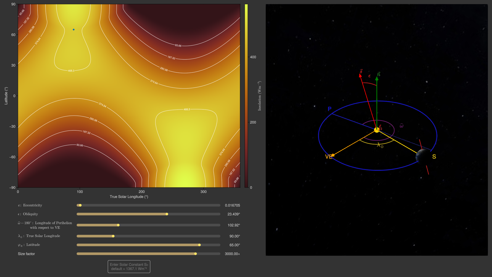

# InsolationExplorer
<!-- [](https://github.com/japhir/InsolationExplorer.jl/actions/workflows/CI.yml?query=branch%3Amain) -->

`InsolationExplorer.jl` is an interactive visualization of the Earth's orbit
around the sun, where we can change the eccentricity (degree to which the orbit
is elliptical), the obliquity or tilt (the angle of the Earth's spin axis with
respect to the orbit normal) and the longitude of perihelion with respect to
the moving equinox.

## Installation

We use the [Julia](https://julialang.org) programming language with the
[Makie](https://docs.makie.org/stable/) plotting library for speedy interactive
exploration.

1. [Install Julia](https://julialang.org/install/).
2. Open the [REPL](https://docs.julialang.org/en/v1/stdlib/REPL/) and
   then copy-paste the below and hit enter.

```julia
using Pkg; Pkg.add("https://github.com/japhir/InsolationExplorer.jl")
```

Running this will take a while, because it will also install `GLMakie`, the
plotting library and all other dependencies. However, after the first install
and launch, everything should be a lot faster!


## Explore the Insolation

Load the package and create the plot
```julia
using InsolationExplorer
i = explore_insolation()
```

This results in the following image:



On the left, we plot the insolation at the top of the atmosphere in watts per
square metre (colour) as a function of the Earth's latitude and the true solar
longitude. Below are sliders to change the orbital configuration!

On the right, we see a 3d visualization of the orbit, the Earth, and if you
zoom out or reduce the scale factor, the Sun. Drag the left mouse button to
rotate around, drag the right mouse button to shift around. Scroll to zoom
in/out.

To get started, I would play around with the obliquity, then exaggerate
eccentricity, and then slide the longitude of perihelion around. Note that the
ranges for the sliders allow for all possible values. If you double-click on
the slider it will reset it to Earth's modern values.

## Explore Solution

In the previous plot it is easy to change eccentricity and obliquity to values
that have never occurred for the Earth. The below plot explores the insolation
as a function of the `ZB18a(1,1)` astronomical solution.

```julia
s = explore_solution()
```

which results in the following image:


On the left, we plot the eccentricity, climatic precession, and obliquity from
the `ZB18a(1,1)` solution (Zeebe & Lourens, 2019, 2022). Drag a
rectangle/scroll to zoom in the top panel. Control + left click to reset the
zoom. Click in the bottom panel or slide the time slider to select a time.
Press space to toggle auto play and proceed through time. Use the left and
right arrows for precise seeking.

On the top right, we plot the insolation at the top of the atmosphere in watts
per square metre (colour) as a function of the Earth's latitude and the true
solar longitude. On the bottom right, we see a 3d visualization of the orbit,
the Earth, and if you zoom out or reduce the scale factor, the Sun. Drag the
left mouse button to rotate around, right mouse button to shift around. Scroll
to zoom in/out.

Note that the reference frame remains the same as the previous one, where the
vernal equinox is fixed in the positive x-axis direction and the orbit normal
in the positive y-axis direction.

<!-- Also note that for the 3d visualization we always plot the ellipse with a
fixed semimajor axis length of 1, rather than the time-varying semimajor axis
with extrema of 0.9999722469706677 and 1.000035840979405. -->

# References

The function to calculate the insolation is based on the equations in Berger
(1978) and Laskar et al., (1993), as implemented in
[`palinsol`](https://cran.r-project.org/package=palinsol) by Crucifix (2023).

We use textures from https://www.solarsystemscope.com/textures/


Zeebe, R. E., & Lourens, L. J. (2019). Solar System chaos and the
Paleocene–Eocene boundary age constrained by geology and astronomy. _Science_,
365(6456), 926–929.
[doi:10.1126/science.aax0612](https://doi.org/10.1126/science.aax0612).

Zeebe, R. E. and Lourens, L. J. (2022). A deep-time dating tool for
paleo-applications utilizing obliquity and precession cycles: The role of
dynamical ellipticity and tidal dissipation. _Paleoceanography and
Paleoclimatology_.
[doi:10.1029/2021PA004349](https://doi.org/10.1029/2021PA004349).

Berger, A. (1978, December). Long-Term Variations of Daily Insolation and
Quaternary Climatic Changes. _Journal of the Atmospheric Sciences_, 35 (12),
2362-2367.
[doi:10.1175/1520-0469(1978)035<2362:LTVODI>2.0.CO;2](https://doi.org/10.1175/1520-0469(1978)035<2362:LTVODI>2.0.CO;2).

Laskar, J., Joutel, F., & Boudin, F. (1993, March). Orbital, precessional,522
and insolation quantities for the earth from -20 Myr to +10 Myr. _Astronomy and
Astrophysics_, 270 , 522–533. Retrieved 2023-04-19, from
https://ui.adsabs.harvard.edu/abs/1993A&A...270..522L

Crucifix, M. (2023, May). Palinsol : A R package to compute Incoming Solar
Radiation (insolation) for palaeoclimate studies. _Zenodo_.
[doi:10.5281/zenodo451.14893715](https://doi.org/10.5281/zenodo451.14893715)
